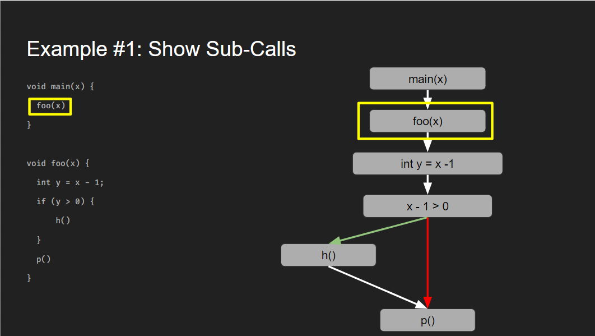

Use this file to commit information clearly documenting your check-ins' content. If you want to store more information/details besides what's required for the check-ins that's fine too. Make sure that your TA has had a chance to sign off on your check-in each week (before the deadline); typically you should discuss your material with them before finalizing it here.

## Check-in 1

> Brief description of your discussions within your team so far, and any current candidate ideas for your project. You should talk with your TA/Alex/Caroline as soon as possible about these ideas; due to the project start mid-week it's OK if you have not yet done this, but make sure to note the progress you have made so far.

The basic ideas we had for a possible project idea was a bit too broad, after some discussion with our TA. We were also a bit confused on the specifics of the project (which was clarified by our TA after our checkin this week), and we had a lot more ideas for a program tool that focused on meta analysis, rather than static or dynamic analysis which the project required. 

One of the ideas we were discussing was to create a debugger like the one in Intellij (creating breakpoints, marking lines for said breakpoints, print out the stack if we do a for loop). With some feedback with our TA, that idea was too big of a project and we need to narrow our scope down. 

The current focus we have (and a goal we have set for the next week, before our next check-in) is to come up with ideas that focused on something a bit smaller and follows the feedback we were given by our TA, which was to think about the use-cases of our tool (who are the users and what do we want to do, to make whatever analysis we find be useful/helpful) and build on an existing tool analysis (like the examples shown in class with Infer and py-spy, and to not write all the code from scratch). The questions we should be asking ourselves is what are the things we want to visualize, what questions do we want to solve, and what is the use case(s) of our program. 

> Any planned follow-up tasks for the next week.

We have set a goal for each of us in the group to come up with an idea (based on/following our discussions and feedback from our TA) before our own team meeting/next check-in with our TA so that we can have more focused/specific feedback, and just to gather more options/ideas for the project.


### TA Feedback for the project requirements

While the possibilities are broad and you're encouraged to be creative, we expect your projects to include at least two of the following three aspects:

(a) The project includes static program analysis (applies to code including at least some challenging features relevant for your analysis topic; targets some property of program behaviour). If you also have a dynamic analysis part, that's no problem, of course.

(b) The analysis applies to a real-world programming language (e.g. Java), for which an existing programmatic API (e.g. AST + Visitors) is employed (you don't have to implement the AST yourself!). We'll have a course-wide shared document for sharing references to useful APIs.

(c) The project includes a substantial visualisation component, summarising and presenting your analysis data in a useful / appealing way.

Note that: 

(a) + (c) allows a project applied to e.g. their DSLs if it has both a static analysis and visualization that's complex enough (building a full-on debugger interface for a symbolic executor for your DSL in project1)

(a) + (b) needs to be on a real world programming language and include a static analysis component. You can have dynamic analysis but this is not required.

(b) + (c) needs to be on a real world programming language and doesn't need a static analysis component

Hope this helps.

### Brainstorming for TA Feedback

The following is a collection of everybodies ideas after a round of asynchronous brain-storming. The notes have been quoted from our each member's idea proposal.

Brian's Idea is:
- to construct a dynamic call/dependency graph of any program 
- This has concerns about the flow and order of execution and is control-flow-sensitive. This could involve module dependencies, function invocations, and execution paths.
- Any language that provides us a visitable AST should work.
- For visualization, we can run/execute and on the fly construct a graph which lights up where the program is currently executing. In addition we can compile time spent in certain modules/packages to also display a heat map as well.
- Plenty of examples of dynamic call graphs are available as well: https://www.freecodecamp.org/news/how-to-automate-call-graph-creation/, https://pycallgraph.readthedocs.io/en/master/, https://emptysqua.re/blog/plop-python-profiler-with-call-graphs/.


Allen's Idea is:
- UML Class diagram generator
- An example of how the final product could look like: https://www.jetbrains.com/help/idea/class-diagram.html#manage_class_diagram
- Regarding implementation, we envision statically get the main structure of the code by just traversing through the classes and then storing any (used?) references (If we want to check used, might need to run dynamically?)
- For even more complexity (if we need) we could also let the tool provide better design decisions (optimal design patterns) or highlight potentially problematic coupling in the code that might introduce problems in the code later on (scalability, etc).
  - This is a bit tricky, but my initial thought on how to do this is to hard-code certain combinations of hierarchy and references that commonly present problems later on and then detect them in the class diagram (Tree search). 
  - A side note, even though design is mostly motivated by the context of what the application is being used for, I think being able to provide suggestions to users might aid in them in reasoning what design patterns/decisions to use and thus could be a relevant feature.


Andrew's Idea is:
- A dynamic analysis performance profiler, that provides extends visualization and provides simple optimization recommendations / point out bottlenecks
- Thinking specifically using Py-Spy (https://github.com/benfred/py-spy) to get our runtime data, and then use it to perform our own analysis.  Though I'm sure there's many other suitable tools to extend.
- Analysis could be performing timing checks by the line, to indicate bottlenecks in the code, and then flag certain optimization strategies that could help. 
  - For example if we noticed them using recursive functions, we could recommend caching strategies.
- For the visual component we could visualize the line usage in a pseudo-heat map kind of way (where we display it as a text file, with each line colour accordingly to use). As well as provide graphs and statistics for certain functions performance. Some kind of simple HTML page would be the easiest to handle this.
- I'm pretty sure the above would be enough, but if we need more we could get into generative the inputs for our performance profiler. It would include random generation but i think we can find / generate suitable simple cases to cover most bases (really small vs really large for numbers or sizes of lists, null reference passes, etc.).


Wonha's Idea is:
- A static analyser that visualized the AST
- Could create visualization by statically checking
- Would allow us to check for basic design/implementation of the code
  - for example, reporting code smells
  - or we could add more rules like coding conventions if want to report more suggstions about the code
- An idea to improve visualization is adding snippets of code represent by each node in ast

Kitty's Idea is:
- Possible analysis questions to answer could be
  - where are memory issues coming from?
  - which execution path is taken for an input
  - which part of the code is crashing? (finding any bottlenecks?)
  - how much memory is being used (performance check/finding any performance bottlenecks? or maybe CPU usage check?)
- Java's VisualVM should be suitable for extension as our tool for initial data harvesting (https://docs.google.com/document/d/1NADVQ4aqwoTfCv7ajVWa0dFxXJAGMKoVMVtgxaF0gWw/edit)
- Possible visualization components
  - Possibilities of some type of graph (i.e. a simple line graph for how much memory is being used compared to overall free memory, something like a web graph where it tells us which execution path it traverses, or a bar graph or heat map based on the analyzation of performance hotspots/method calls)
  - Since most types of graphs have been mentioned in class (like flame) and by suggestions above, something else to consider may be the sunburst graph where we group the analyzed method calls and we could zoom in and out to increase the details/depth (adding an interactive layer to make the program analysis more complex)?
  - if we try to answer which part of the code is crashing, to show/highlight the code that is causing the issue

## Check-in 2

> Brief description of your planned program analysis (and visualisation, if applicable) ideas.

Our planned analysis will be statically determining which control flow paths are definitely taken, or definitely not (We plan to choose just one). 
We plan to do this through static analysis, and then visualize the different control flow patterns that exist in a pseudo call-graph.

For clarification,
```
void main(x) {
  foo(-32)
}

void foo(x) {
  int y = x - 1;
  if (y > 0) {
      h()
  }
  p()
}
```
In the previous example, static analysis on main should show that h() is definitely not called. And conversely,
```
void main(x) {
  foo(x)
}

void foo(x) {
  int y = x - 1;
  if (y > 0) {
      h()
  }
  p()
}
```
In this example, we would not able to determine statically that h() is not called and thus, would have to show it as potential control flow divergence in our graph.

> Notes of any important changes/feedback from TA discussion.

We took a lot of feedback from both Madonna and the professors. 
Initially the idea concerned a dynamic call graph, but on discussion with one of the professors (Alex), they indicated that the idea would have to be extended in order to be control flow sensitive.
Alex suggested that we create our control flow visualization statically, as that would be more akin to the project's desired outcomes and expectations.
> Any planned follow-up tasks or features still to design.

We have just finalized our idea itself. So we now plan to cement it. 
Meaning we still need to choose our target language, and specify the subset of it that we wish to support, we expect this to be a rather large task, and we want to plan this more thoroughly than our last project.

> Planned division of main responsibilities between team members.

We have yet to discuss division of responsibilities, but we plan to divide the project based on individual skill and interest. 
We envision having somebody take the role of project manager (handling coordination, scheduling, and checking in about individual progress), as well as a visualization team, and an analysis team. 
Ideally, those who conduct our user-studies would be spread from the visualization and analysis team, but all these plans/roles are not cemented.

> Summary of progress so far.

Up to this time, we have defined our project idea and objectives for the overall project. We have conducted research into static and dynamic analysis strategies and the kinds of problem-solving methods that are used in the space. As well, we have outlined the rough architecture of what our analysis will use.

> Roadmap for what should be done when, including specific goals for completion by future Milestones (propose at least three such goals per future Milestone, along with who will work on them; you can revise these later as needed).

Our current roadmap is, and we have yet to decide who will work on what specifically, currently we will all collaborate.
- Milestone 0: March 8th (Current milestone)
  - Finalized project architecture
  - Complete implementation plan
    Establish clear subset of target language, and potential stretch-goal features.
  - Assign roles and responsibilities
  - Establish individual concerns and goals
- Milestone 1: March 15th
  - Conduct first user-studies and get feedback on UI and analysis
  - Front-end finalization
    - Have completely finished concept of UI visualization
    - Begin implementation of visualization component
  - Analysis implementation
    - Finalized project architecture, and tools used
    - Begin implementation of analytic functions
- Milestone 2: March 25th
  - Front-end finalization
    - Front-end / visualization module is completed
  - Back-end analysis
    - Analysis implementation complete and validated
- Milestone 3: April 5th
  - Project finalization
  - Final User study
  - Video demonstration filming

## Check-in 3
### User Study Protocol

We presented participants with a short slide deck that introduces our project, outlines some goals of our study, goes over a mock-up example, and then presents a few decisions that we wanted their direct feedback so we can incorporate into our design. Throughout the process we encouraged participants to ask clarifying questions. The full slides can be found [here](./resources/initial_user_study.pdf).

Some highlights from the user study guide:

**Refresher on control flow graphs**:


**Guiding questions**:
* Would you use this tool?
* How would you want to interact with such a tool?
* How would you want the graph to be visualized?

**Design decisions for the end-user**:
1. Should we show or hide sub-calls?



2. Should we simply trim dead paths or show dead paths?


3. Should we visualize it line-by-line or block-by-block?


4. Do you want to upload an existing file into the program or be able to write within the tool itself?


### User Study Results

Both participants recruited were computer science or computer engineering students who were familiar with static analysis tools and were representative of our tool's target userbase.

They both believed that the tools had its uses in visualizing predicates and branches, making it easier to understand the debugging process; however, there was some skepticism to the degree to which this may be useful for their everyday development workflow as there are existing implementations of parts of our tools (e.g. some IDEs can immediately check if the branch of a condition is not evaluated). Overall, participants are interested in seeing the final product.

Responses to our four design decisions:
> **Should we show or hide sub-calls?**

Respondents would both prefer to see the sub-calls as these are important to understanding the overall path of execution of each method.

> **Should we simply trim dead paths or show dead paths?**

Respondents agreed that they want to see un-trimmed paths (and mark which paths are dead) because otherwise it is not immediately obvious there was branching logic originally. There were no strong opinions on how to visualize dead branches so long as it is clear.

> **Should we visualize it line-by-line or block-by-block?**

Both feel that block-by-block may be neater and simplistic.

> **Do you want to upload an existing file into the program or be able to write within the tool itself?**

It was pointed out that if we asked users to upload an existing file, and then on the fly updates to the code were made, users would have to reupload the file again continuously which would be tedious for continuous use.  

### Notable Changes/Updates

We have narrowed down the scope of our analysis, i.e. where can we definitively say a control flow path will not be taken:

**In-scope**:
* Variable declarations & assignments
* Control flow statements
  * If-then-else
  * While loops
  * For loops
  * Switch statements
* Data types (primitive vals):
  * Integers, booleans, strings

**Out-of-scope**:
* Arrays, vectors, custom classes
* Try-catch, exception handling
* Lambda & higher-order functions

### Progress So Far

We have settled on the overall idea for our project and have targeted our real-world programming language (Java) and parser (JavaParser). 

We are just about to finalize which visualization library we are using (currently leaning towards a library in Java itself).

We are decided on roles for the team and how to split up work overall.

Next steps:
* Layout AST tree designs (if necessary as a sort of pre-processed input to viz)
* Define behaviour for majority of edge cases
* Fully define analysis/viz interface
* Begin writing unit tests
* Begin implementation

## Check-in 4

### Status of implementation so far.
#### Analysis
* Decided to use JavaParser for creating AST tree.
* Group played around with the parser to understand how it worked, etc.
* Finished Drafting Intermediary Datastructure.
* Briefly outlined groundwork of implementation.

#### Visual
* Decided to use graphviz for creating visualization.
* Experiemented a bit with the library.
* Defined front-end representation.

#### Overall
* Finished defining limits of program
* Clarified and finalized visualization for certain complex control flow elements (for, foreach, while)

### Plans for final user study.
* User studies will not greatly differ from how our previous one went. We plan on incorporating a concrete implementation of our application (if possible) for the users to use.
* The set planned deadline for our user study is TBD but will probably be held ASAP when we have a rough working implementation of our application.
### Planned timeline for the remaining days.
* Here is our tentative planned timeline for the remaining days. 

Milestone 1: Week of March 15th
* Layout AST tree designs (if necessary as a sort of pre-processed input to viz)
* Define behaviour for majority of edge cases.
* Fully define analysis/viz interface.
* Begin writing unit tests
* Aim to have a rough prototype for completion of analysis/visualization implementation.
* Front-end finalization
    - Have completely finished concept of UI visualization
    - Begin implementation of visualization component
* Analysis implementation
    - Finalized project architecture, and tools used
    - Begin implementation of analytic functions

Milestone 2: Week of March 25th
* Have a rough completed implementation of program.
* Create user study docs + procedure
* Finish readme
* Front-end finalization
    - Front-end / visualization module is completed
* Back-end analysis
    - Analysis implementation complete and validated

Milestone 3: Week of April 1st
* Finish up any last details
* Integration and end-end tests
* Make a slide deck for the video: Project 2 slides (in progress)
* Make the demo video
* Conduct final user studies

Milestone 4: Week of April 9th
* Submit Project 
* Ensure we have proper documentation for user studies + how to set up and run on a fresh machine


### Progress against the timeline planned for your team, including the specific goals you defined (originally as part of Check-in 2) for Check-in 4; any revisions to Check-in 5 goals.
* Currently we are on track with our planned timeline from Check-in 2. There are no major revisions for our planned goals.

## Check-in 5

### Status of Final User Study.

It is yet to be done. This will be updated as soon as final user stydt is done.

### Plans for final video

We will create a slideshow that demonstrates the motivation, output and limitation of our program. It will be recorded with narration that gives additional details as needed.

### Planned timeline for the remaining days.

This timeline could change anytime.

* Apr 3 : Completion of implementation
* Apr 4 : Final user study
* Apr 6 : Video Recording / Submit

### Progress against the timeline planned for your team, including the specific goals you defined

We are following the timeline and are happy with where we are at in terms of progress.

