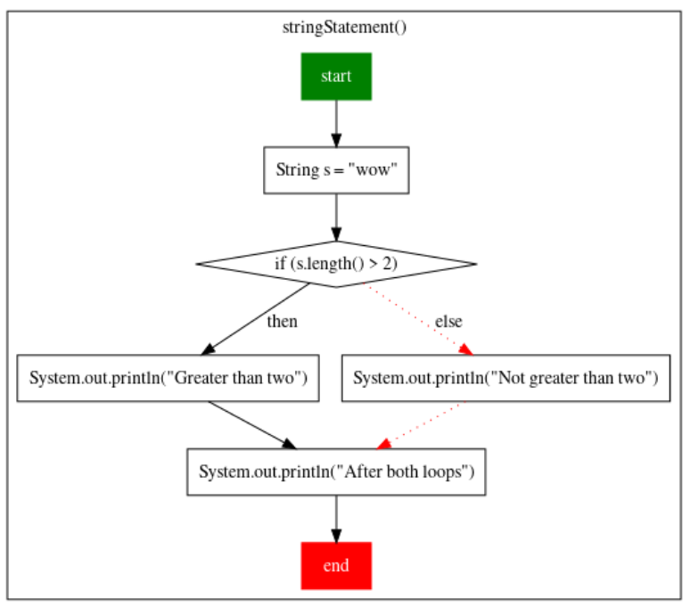
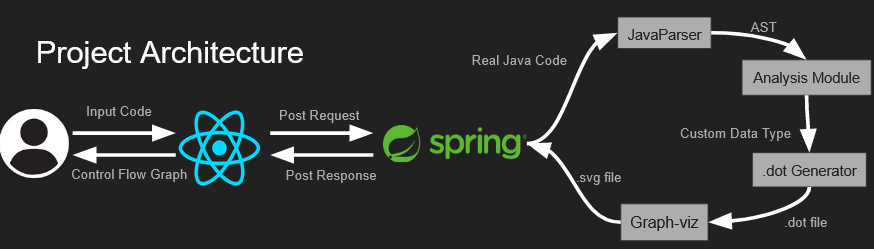
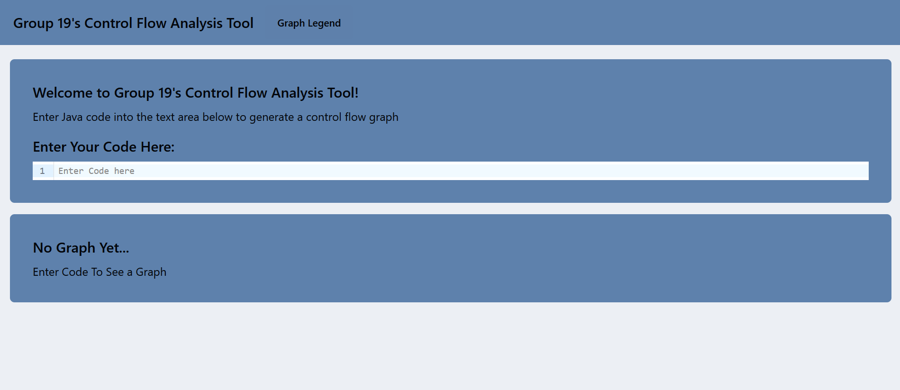
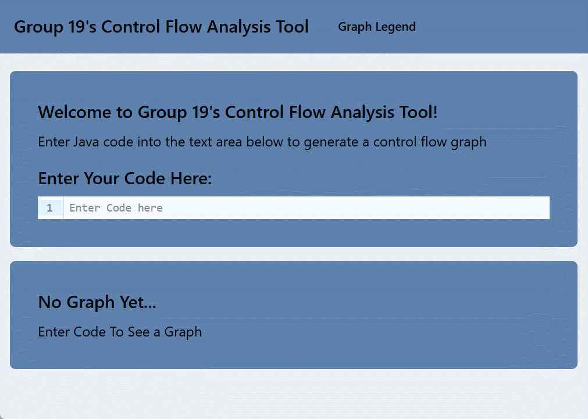
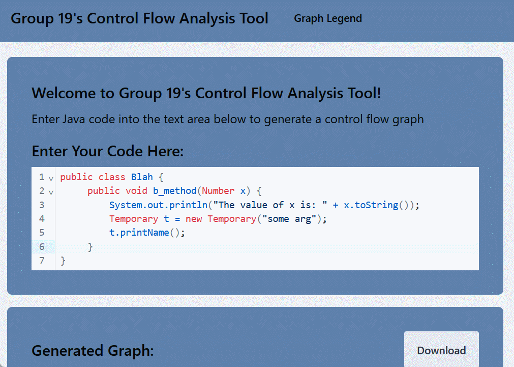
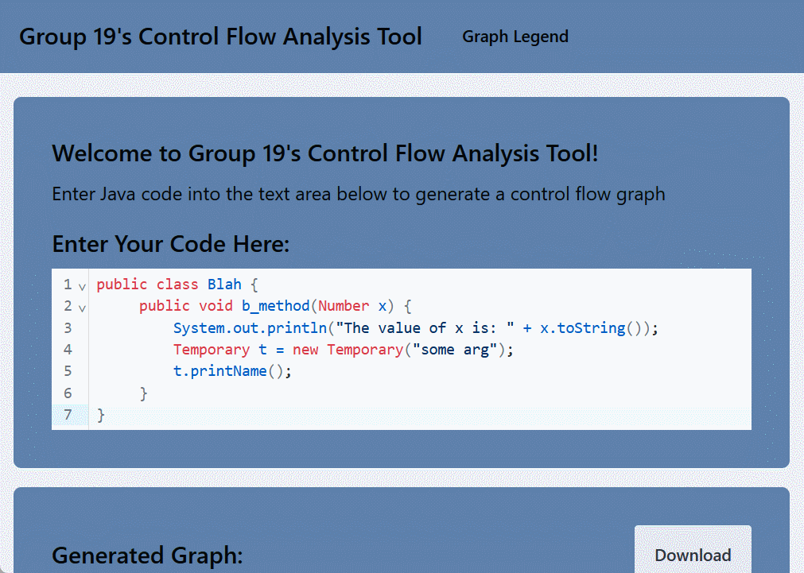
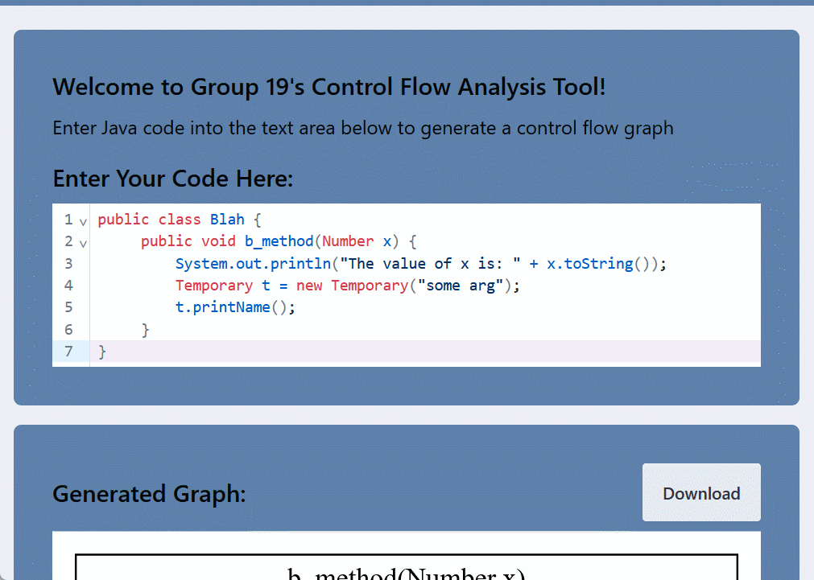
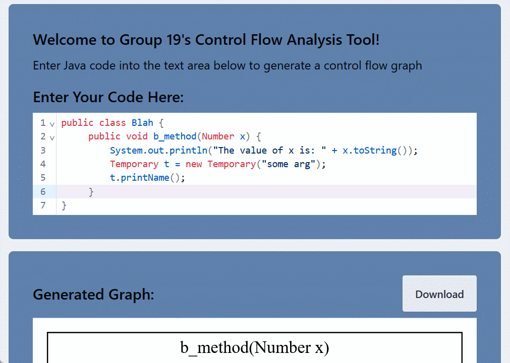
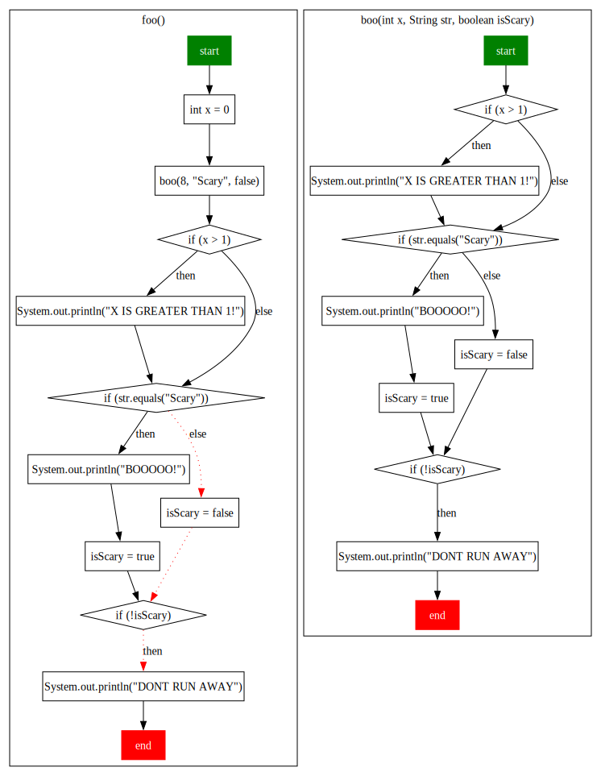
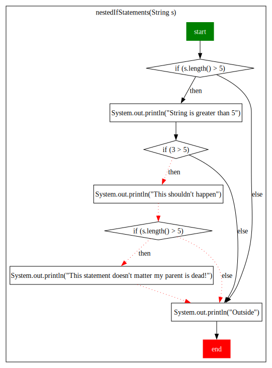

# Introduction

Our program takes in a valid Java program as input and produce control flow graphs as output. We highlight control flow paths that are **definitely not** going to be taken under any circumstances by taking a pessimistic static analysis approach. 

For example, we would take code like: 

```
public class SomeClass {
    public void stringStatement() {
        String s = "wow";
        
        if (s.length() > 2) {
            System.out.println("Greater than two");
        } else {
            System.out.println("Not greater than two");
        }
        
        System.out.println("After both loops");
    }
}
```

And it would return a graph like this, indicating that the `else` branch is dead via  red dotted line:



We envisioned this as a tool that would help users analyze the real execution paths their programs may take, or more importantly, which paths their programs were absolutely not going to take.



On a very basic overview of our project architecture, we basically have a request sent to the backend whenever a user inputs a code. Then in the backend, our parser creates an AST from the input code and then passes it to our analyzer which will then pass the tree structured data to the visualization portion of the backend to generate the graph. Once the graph is generated into a `.svg` file, it will be sent back to the frontend and that is what displays.

### External Frameworks/Libraries Used
#### Frontend made with:
- ReactJS
- DaisyUI/Tailwind CSS
- Axios

#### Backend made with:
- Spring Boot
- JavaParser
- Symja
- Graph-viz

## Another Example/User Guide

Once the program loads, the landing page should show something like this:



You can add the code that you want to be analyzed/generated into a control flow graph in the textbox as so:



<sup> <sub> <b>Note:</b> If, on the very first attempt of pasting your code generates an error message for the graph visualization (specifically when the program/landing page first loads), please update the code in the textbox, such as adding or deleting an unneeded space.</sub> </sup>

You can also check out the graph legend when needed by clicking the legend on the navigation bar at the top:



You do not need to reload everytime to generate a new graph; just revise the code in the textbox area and a new graph will be generated (<b>note:</b> you will need to make sure that you keep a class declaration):





You can also download the generated graph (as `.svg` files) by clicking the download button:



# Installation Guide

To run the front-end, cd into `frontend`. Then run `npm install`, and then `npm start:frontend`.

To run the back-end, run `GraphApplication` in the `viz` folder.

# Other Materials/More Information

Please check out our user study materials [here](./resources/initial_user_study.pdf). 

A more in-depth guide/understanding to our project in form of a slide deck can be found [here](https://docs.google.com/presentation/d/1JOBx7TnG6uyRH3Ou_ucBbNBlyehiheY84wemp-j4Qi4/edit?usp=sharing).

# Limitations/Current Issues

- There are still a few bugs that we would like to fix but have not found the solution yet, such as currently running `npm start` will run both frontend and backend, but it will always fail to load the first time (updating the code in subsequent attempts (even for the same piece of code) such as adding or deleting an unneeded space will allow it to work)
- Because we split up the workload by separating into two teams (Analysis and Visualization), there were two different workflows going at different paces, creating some separation in different areas that we would have liked to fix/merge (i.e. in folder organization and tests)
- Due to the frameworks we used, there are some strict requirements for the input such as:
  - code must be syntactically correct; ideally it should be copied from compilable project
  - a class must be declared (and only one) for the code parsing to work
  - `camelCase` should be used for variable naming (not `snake_case`)
  - some words will need to be avoided in the names of variables (basically everything in [this list](https://mathda.com/en/calculator-usages/symja/reference/99-function-reference) in `Symja`), such as `sum`, `max`, `length`

- Our program currently supports visualization of multiple language statements and also value-sensitive flow analysis that is limited to primitive variable types and small portion of non-primitive type variables. However, our program does not support value sensitive loops and unconventional conditional statements.
  - This is an “all-executions” property and is difficult to reason for all possibilities
- Since our program is focused on value-sensitive static analysis, features such as value-sensitive loops, non-primitive type variables (outside of str and []), and multi-class analysis are simply too difficult or complex to implement due to all the possibilities of control flow.
- Additionally, since we are using `Symja` to evaluate statements, which has a lot of quirks we had to deal with, statements need to first be manually parsed into relevant forms before being evaluated and thus we decided to only support a select few statements that we deem as more important. This may mean that some more unconventional or uncommon statements may not be supported.
  -  for example the statement `x % 5` has to be transformed to `Mod(x, 5)`
  - catching all such cases is doable but it takes time and we wanted to focus on completing the project in a reasonable timeframe
- Other supported and unsupported features can be seen in the table below:

| Features                                                                                            | Visualization                  | Value-Sensitive |
|-----------------------------------------------------------------------------------------------------|--------------------------------|-----------------|
| User-defined method declarations and user-defined method calls within the given file                | ✅                              | ✅               |
| Method declarations or method calls outside of the given file                                       | ✅                              | ❌               |
| Multiple classes in the same file                                                                   | ❌                              | ❌               |
| Variable declaration and assignment with numbers, booleans, strings<sup>†</sup>, arrays<sup>*</sup> | ✅                              | ✅               |
| Variable declaration + assignment with everything else (custom classes, etc.)                       | ✅                              | ❌               |          
| Conditional (If/Else) branches                                                                      | ✅                              | ✅               |
  | While loops                                                                                         | ✅                              | ❌               |
  | For and Foreach loops                                                                               | ✅                              | ❌               |
 | Switch statements                                                                                   | ✅                              | ❌               |
  | Return statements                                                                                   | ✅                              | ❌               |
 | Assert statements                                                                                   | ❌                              | ❌               |
  | Try/catch and exceptions                                                                            | ❌                              | ❌               |
  | Code comments                                                                                       | ❌                              | ❌               |
  | Unary statements (e.g. `i++`) and syntactic sugar (e.g. `+=`)                                       | ✅                              | ❌               |
| Nested inline functions <sup> o</sub>                                                               | ⚠️   (only some functionality) | ❌               |

<sub> <sup>†</sup> Equality operations supported </sub> <br>
<sub> <sup>*</sup> Length operations supported </sub> <br> 
<sub> <sup>o</sup> Will be visualized outerwards to inwards</sub> 

## Specific Feedback/Changes from (final) User Studies

The process of our final user studies were similar to the [first user study (checkin 3)](https://github.students.cs.ubc.ca/CPSC410-2023W-T2/Group19Project2/blob/main/CHECKINS.md#check-in-3) where we showed our prototype and design. This time however, we had 3 specific goals in mind that we wanted to check:

- evaluating the intuitiveness of our frontend
- do users find our tool helpful?
- would they add it to their IDE?

And the responses were promising! Overall, users have found that this would be useful for both visual learners and beginners, and they felt that they would potentially add this to their IDE. Users felt that our project is a good starting point, and they would like to see value-sensitive loop analysis and the ability to simulate a range of inputs for a given function to see how it performs under different circumstances before they would use it as a part of their day-to-day workflow.

They also gave some feedback on features they would like to see in the future such as supporting more functionality like reasoning about loops, AST nodes and more UI improvements. Based on their feedback, we have incorporated some features that we could do in the time frame that was left, like visual enhancements and a code editor textbox. For more details, please see below where we answered some of the questions our users left at the end of the study:
#### Can we support the modulus `%` operation?
  - This was something we overlooked and have implemented in the final product.
#### Can we make recursive calls?
  - During the user study, recursive calls would cause an error to be shown on the screen. In the final product we have resolved this and cyclic calls are now visualized.
#### Why do nested inline calls like `left(right())` resolve outwards to inwards (i.e. `left` is first and then `right`)
  - Our static analyzer tool processes the AST in this order (from left to right), which is different from how code is actually executed (which is inwards to outwards). This is a non-trivial fix as we would have to find a way to visit the arguments of an AST node prior to the node itself, ensure that the edges of the graph line up correctly and ensure that we do not revisit the same AST node multiple times. This would be on the top of our priority list given more time.
#### What was the reasoning behind our graph shapes?
  - We looked at different control flow graphs and picked ones we thought were reasonable (as there seemed to be no standard model); but we did note that `if` statements were usually diamonds
#### The textbox was a bit hard to navigate (i.e. it's hard to see when there are a lot of line breaks, no auto tab spacing if typing into the textbox)
  - We originally had a textbook that could be resized, but as some users were either having trouble realizing that on their own and the initial textbox size was considered too small, we decided to change it into a style like an actual code editor (through an extension) which will always adjust to the lines of code, tab correctly, and also highlight java syntax correctly
#### Is there a way to make less padding for the shapes?
  - Given the amount of time we have left from the final user study and the project due date, we decided to leave that up for a possible to-do, if we were to work on this longer as we depend on `Graph-viz` library for the generation of our graphs (in a visual way) and to change how the graphs generated would require some dynamic sizing logic
    - we had initially considered generating graphs using our own logic but as the project focused more on project analysis, we decided that that may have been too large of a scope to include, and we narrowed it down to only use the `Graph-viz` library
#### Could we add some other more visible things to our graphs to show that some statements are unreachable?
  - This suggestion/request was something we decided would be good, but with the `Graph-viz` library, the nodes have no concept of "reachability", so we decided one way to enhance visibility for unreachable statements was to colour the edges in red.
#### Would it be possible to add a zoom/pan feature?
- We did try to look into such a feature but implementation of it broke our UI in different ways and with the time we had left, we wanted to focus more on completing our program analysis part of this project instead of focusing on fixing UI bugs. So, we decided to leave this as another possible to-do for future extension. This was also a reason why we implemented a download button (for the graph as a `.svg` file).
#### Other/Misc.
- We also fixed some bugs that we and our users found during the course of the final study such as fixing the bug where sometimes the `end` box just floats when we gave more than 1 function.
#### Final remarks/conclusion:
  - Overall, it definitely can be seen how and why this might be useful for visual learners or beginner coders to add to their IDE
  - Seemed really useful for debugging under different workflows.

# Overall Evaluation of Our Project

#### Overall, we are pretty happy with:
- the ease of tool use through our front-end (live editing workflow)
- being able to connect our front-end and back-end (which had been a real big challenge to solve)
- having the reasoning capabilities with operations on data-types beyond primitives (Arrays, Strings, etc.)
- how our program seems useful for the users in our user studies and that they could see/understand why our program may be useful for visual learners/beginner coders and debugging

#### If we had the opportunity and time in the future, we would like to:
- have an integration with a real IDE/not needing to start the frontend and backend separately
- being able to zoom/pan
- more colour/sizing/descriptive options for graph generation
- enhance the analysis capabilities by incorporating additional features
  - adding both visual components and performing value-sensitive analysis
  - make return statements value-sensitive
  - address the discrepancy of our static analyzer resolving from left to right `(left(right()))` as actual code execution is inwards to outwards 
  - investigate pessimistic reasoning capabilities in for/while loop variants

# Select examples (see more in the /src/test/testClasses folder)
```
package testClasses;

public class MethodCallWithArguments {

    public void foo() {
        int x = 0;
        boo(8, "Scary", false);
    }

    public void boo(int x, String str, boolean isScary) {
        if (x > 1) {
            System.out.println("X IS GREATER THAN 1!");
        }

        if (str.equals("Scary")) {
            System.out.println("BOOOOO!");
            isScary = true;
        } else {
            isScary = false;
        }

        if (!isScary) {
            System.out.println("DONT RUN AWAY");
        }
    }
}
```

```
package testClasses;

public class NestedStaticallyDeterminableIfTest {
    public void nestedIfStatements(String s) {
        if (s.length() > 5) {
            System.out.println("String is greater than 5");

            if (3 > 5) {
                System.out.println("This shouldn't happen");

                if (s.length() > 5) {
                    System.out.println("This statement doesn't matter my parent is dead!");
                }
            }
        }
        System.out.println("Outside");
    }
}
```



